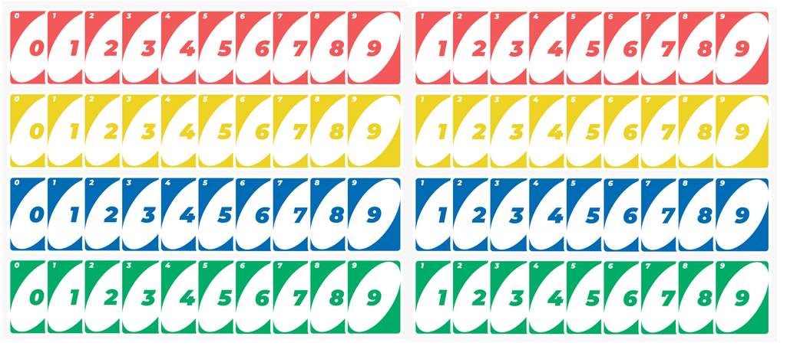
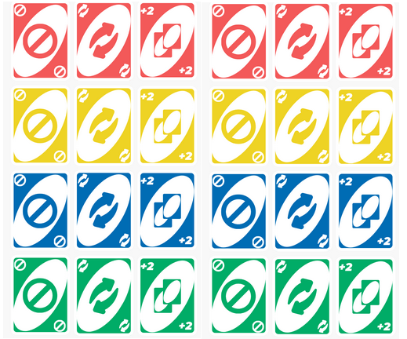
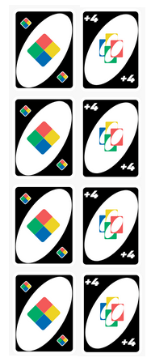

# Uno Card Game

### Objective of the Game

To be the first player to get rid of all your cards.

### Deck

The Uno deck contains 108 cards, which includes 76 numbered, 24 special, and 8 wild cards:

#### 76 Number cards

- `0 `: 1 card for each color = 4 cards
- `1`: 2 cards for each color = 8 cards
- `2`: 2 cards for each color = 8 cards
- `3`: 2 cards for each color = 8 cards
- `4`: 2 cards for each color = 8 cards
- `5`: 2 cards for each color = 8 cards
- `6`: 2 cards for each color = 8 cards
- `7`: 2 cards for each color = 8 cards
- `8`: 2 cards for each color = 8 cards
- `9`: 2 cards for each color = 8 cards

#### 24 Special cards

- Skip Card (2 red, 2 yellow, 2 green, and 2 blue) = 8 cards
- Reverse Card (2 red, 2 yellow, 2 green, and 2 blue) = 8 cards
- Draw 2 Card (2 red, 2 yellow, 2 green, and 2 blue) = 8 cards

#### 8 Wild cards

- 4 Wild cards (each black)
- 4 Wild Draw 4 cards (each black)

### Setup

Shuffle the deck and deal 7 cards to each player. Place the remaining cards face down on the table to create a draw pile. Flip the top card over to create a discard pile.

### Game-play

The player to the left of the dealer goes first. They must either match the color or the number of the card on the top of the discard pile. If they cannot play a card, they must draw one card from the draw pile. If they can play the card drawn, they may do so, otherwise their turn ends.

### Action Cards

There are four types of special action cards:

1. Reverse Card: Reverses the direction of play.
2. Skip Card: Skips the next player's turn.
3. Draw Two Card: Forces the next player to draw two cards and lose their turn.
4. Wild Card: Allows the player to choose the color for the next turn.

If a player plays a wild card, they must also choose which color they want to be played next. If a player has a card that matches the color chosen by the player who played the wild card, they can play it.

If a player plays a Draw Two or Draw Four wild card, the next player must draw the appropriate number of cards and lose their turn. The player who played the Draw Two or Draw Four card can continue playing their turn.

If a player does not have any playable cards in their hand, they must draw a card from the draw pile. If they still cannot play, their turn ends.

### Winning

The first player to get rid of all their cards wins the game. The game continues until a player has played all their cards.

### Scoring

At the end of each round, the winner earns points for the cards left in their opponents' hands. The points are tallied up, and the first player to reach 500 points is declared the winner of the game.
